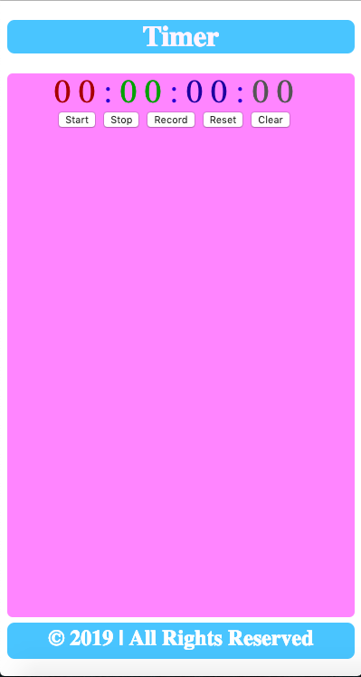
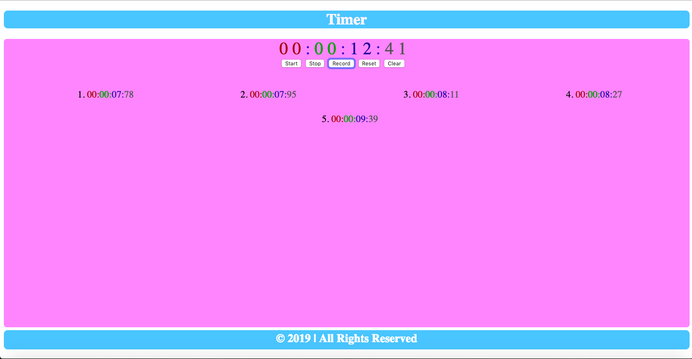
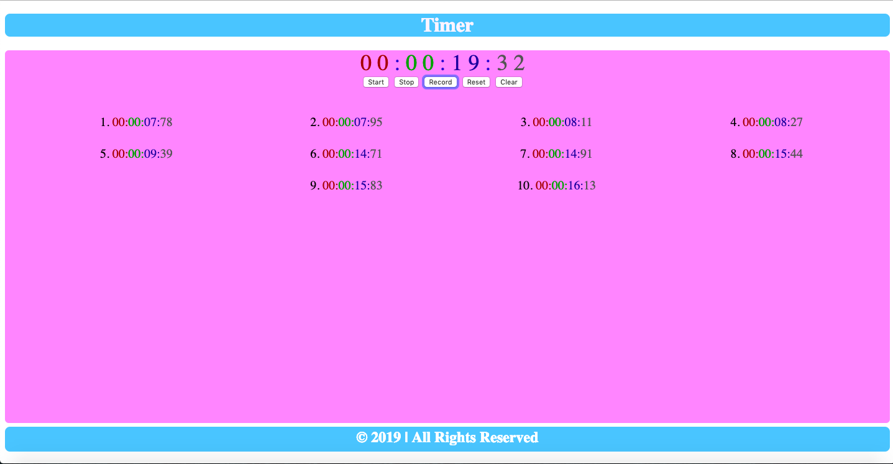
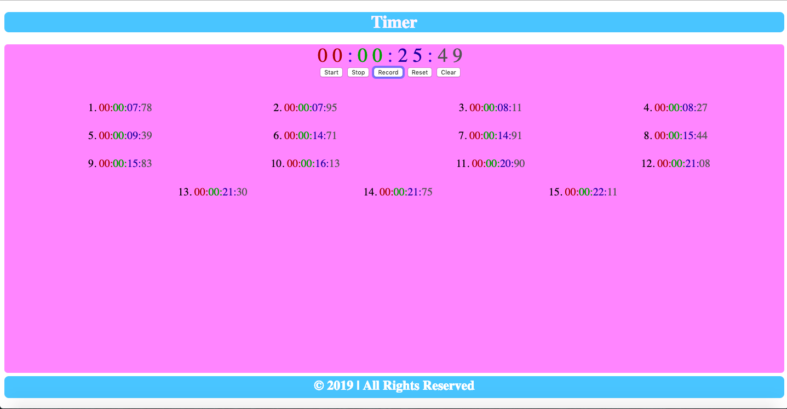
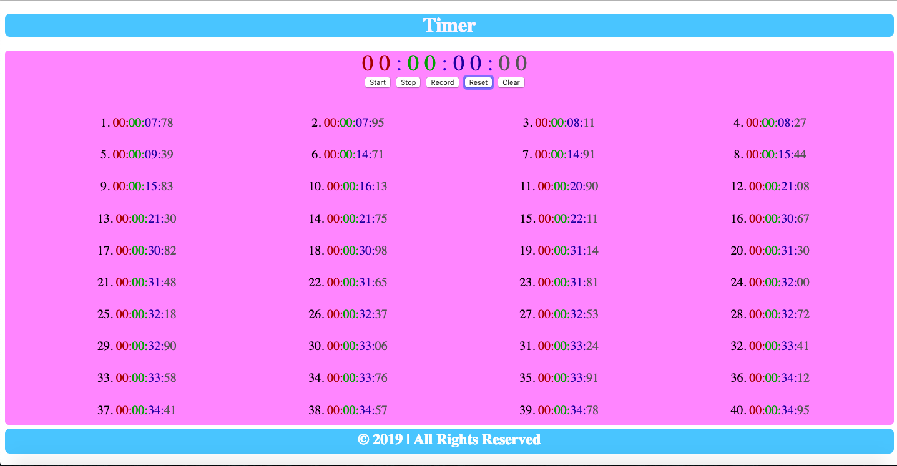

# Timer

### How to start
> 1. Go to the project's download folder
> 2. Right click on the file named _index.html_
> 3. Go to the _open with_ option
> 4. Chose a browser to view the page in

### How to use
> 1. Press start button to start recording
> 2. Press stop button to stop recording
> 3. Press record button to save current time
> 4. Press reset button to reset timer
> 5. Press clear button to delete recordings

### Requirements
> 1. This project requirements a browser
> 2. The broswer should have Javascript available and enabled

### Preview

